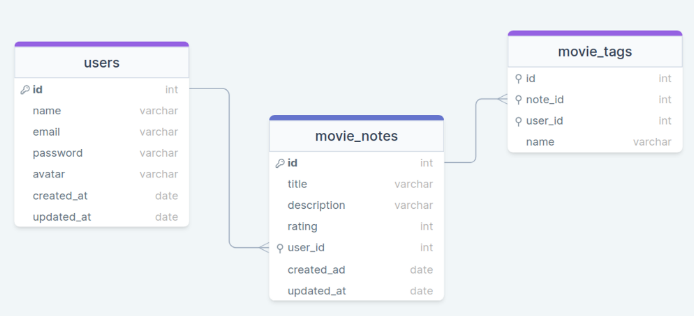

# Node Movies 🎥

* Aplicação em Node.js onde o usuário cadastra um filme, preenche com algumas informações (nome, descrição, nota) e cria tags relacionadas a ele.


  
## Detalhes adicionados ao projeto:
- Criptografia de senhas;
- Validação de e-mail;
- Aplicação do Cascade para garantir que uma tag será excluída caso o usuário opte por excluir a nota.


## Para rodar a aplicação, use os seguintes comandos:

```
npm install

npm run dev

npm run migrate
```

### By: [Beatriz Galvão](https://www.linkedin.com/in/beatriz-galmed/) 💜

